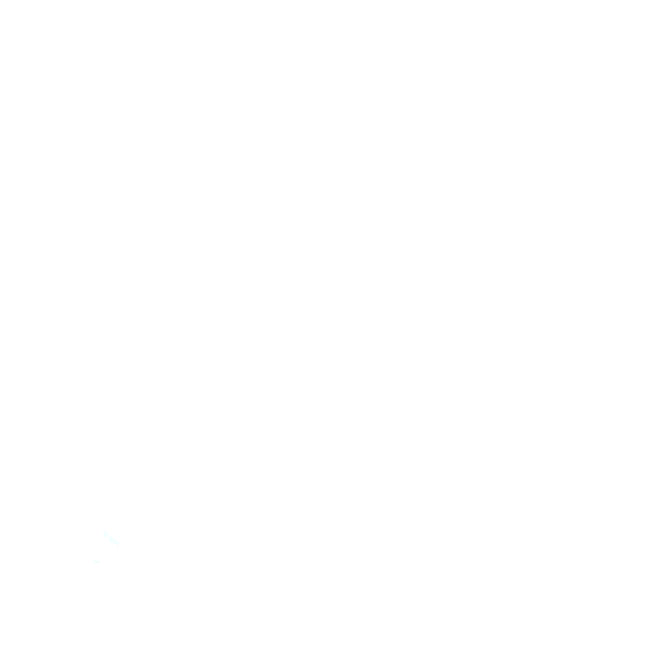

<div id="top"></div>
<p align="center">

</p>
<br />
<p align="center">
  
  <h3 align="center">XDT-JS</h3>
  <p align="center">
    The best and easiest to use graph creator, for JavaScript.
    <br>
    <a href="https://github.com/PixelDevelops/xdt-js/wiki">Documentation</a>
    ·
    <a href="https://github.com/PixelDevelops/xdt-js/issues">Report bug</a>
    ·
    <a href="https://github.com/PixelDevelops/xdt-js/issues">Request feature</a>
    ·
    <a href="">Support us</a>
  </p>
</p>
  
<details open="open">
  <summary>Table of contents</summary>
  <ol>
    <li><a href="#about-xdt">About XDT</a></li>
    <li><a href="#support-us">Support us</a></li>
    <li><a href="#reporting-bugs-and-suggesting-features">Report bugs and suggest features</a></li>
    <li><a href="#documentation">Documentation</a></li>
    <li><a href="#adding-onto-xdt-yourself">Forking XDT</a></li>
    <li><a href="#prerequisites">Requirements/prerequisites</a></li>
    <li><a href="#changelog">Changelog</a></li>
    <li><a href="#license-mit">License</a></li>
  </ol>
</details>

## About XDT
XDT was founded by [PixelDevelops](https://github.com/PixelDevelops) as well as many other contributors (if there are any). It's main goal was to improve how graphs were made and look for web pages. XDT is super customizable, allowing for node smoothing, custom size and shape, and much, much more. XDT has a flexible, and accessible API, which can be used to access nearly anything about a certain web page's graph(s).

As time went on, XDT got increasingly more complex, however, thanks to the people who have made issues, we were able to squash the bugs in order to become what we are today. Even though XDT is very, very complex, and looking at it's source code maybe a bit hard to understand, it still delivers, nonetheless.

And of course, we can't thank you guys enough for suggesting more and more features to put into this, even though it is already hard enough for us to code this type of stuff, it would allow for better, or more functionality within our API. A big thank you to the people who have supported us on Patreon, because we really wouldn't be able to do this without you.

<p align="right">(<a href="#top">back to top</a>)</p>

## Support us
If you like our work, and the things we do with it, you can support us on Patreon, which is the fourth link at the top above. You get early access to updates, see what we are doing behind the scenes, and our Trello board, which helps us keep track of what we have, and do not have done.

If you can, please go support us on Patreon, now are trying to beg for anything here, but our team is putting their utmost effort to bring this out for you guys. Doing so, it would mean the world too us, and would motivate us to work on the project further, to improve it.

<p align="right">(<a href="#top">back to top</a>)</p>

## Reporting bugs and suggesting features
For our sanity, we do not have enough time to test XDT. So, it would be of great pleasure to us if you were to report any bugs (as a developer) to us in the Issues tab of this repository. Again, we want to make sure that this application is clean, and free of errors, to prevent loss of encouragement to work on your and our projects.

If you wish to suggest a feature, we will gladly take it into consideration, as a team. It may, or may not get added, depending how hard it is to integrate, and depending how much estimated time it would take to get this done, and move on to the next feature.

<p align="right">(<a href="#top">back to top</a>)</p>

## Documentation
The documentation for XDT holds all methods, and everything that is accessible to the developer (you). If you seek the documentation, you can click the up at the top of your screen that says "Wiki," and that will bring you to the documentation. The documentation gives a full explanation of how XDT works, what makes it work, how to set it up, how to use it, and more.

<p align="right">(<a href="#top">back to top</a>)</p>

## Adding onto XDT yourself
We allow anyone to fork this project and add onto it themselves. However, if you fork this project at the latest version, and XDT gets updated, it will not update with it. If you come across an error while adding to it yourself, it's fine, you can come back here and make an Issue with the "Fork" tag, and we will try our best to help you with it.

<p align="right">(<a href="#top">back to top</a>)</p>

## Prerequisites
As time goes on, you will need to install more packages, for XDT to be able to run on the latest version. The packages are seperated by the ones that are new in this version, and the ones that have been in the last version, so it is easy to distinguish between the two. Before installing any of the packages listed below, you will need to install [Node.js](https://nodejs.org/), and select the platform according to your operating system. Also, make sure to get the latest version.

To use XDT, you will need to install the following packages in a terminal or application where you can execute commands:

Newest in this version:
```
npm install express
```

<p align="right">(<a href="#top">back to top</a>)</p>

## Changelog
If you want to see the new features of the latest XDT version, we have a changelog made just for that, which you can view [here](https://github.com/PixelDevelops/xdt-js/blob/main/CHANGELOG.md). We do not delete old versions. This changelog reports on everything that has not been added in the previous version, or was taken out of a previous version, and put back in.

<p align="right">(<a href="#top">back to top</a>)</p>

## License (MIT)
Copyright (c) 2022 pixelxd

Permission is hereby granted, free of charge, to any person obtaining a copy
of this software and associated documentation files (the "Software"), to deal
in the Software without restriction, including without limitation the rights
to use, copy, modify, merge, publish, distribute, sublicense, and/or sell
copies of the Software, and to permit persons to whom the Software is
furnished to do so, subject to the following conditions:

The above copyright notice and this permission notice shall be included in all
copies or substantial portions of the Software.

THE SOFTWARE IS PROVIDED "AS IS", WITHOUT WARRANTY OF ANY KIND, EXPRESS OR
IMPLIED, INCLUDING BUT NOT LIMITED TO THE WARRANTIES OF MERCHANTABILITY,
FITNESS FOR A PARTICULAR PURPOSE AND NONINFRINGEMENT. IN NO EVENT SHALL THE
AUTHORS OR COPYRIGHT HOLDERS BE LIABLE FOR ANY CLAIM, DAMAGES OR OTHER
LIABILITY, WHETHER IN AN ACTION OF CONTRACT, TORT OR OTHERWISE, ARISING FROM,
OUT OF OR IN CONNECTION WITH THE SOFTWARE OR THE USE OR OTHER DEALINGS IN THE
SOFTWARE.

<p align="right">(<a href="#top">back to top</a>)</p>
